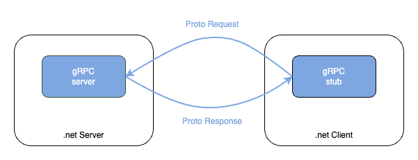

# gRPC demo
Basic server client to learn more about gRPC.

<!-- TOC -->

- [gRPC demo](#grpc-demo)
- [What it is gRPC ?](#what-it-is-grpc-)
- [When to you use it ?](#when-to-you-use-it-)
- [When to not use it ?](#when-to-not-use-it-)
- [Pros anc Cons](#pros-anc-cons)
    - [Pros](#pros)
    - [Cons](#cons)
- [Example](#example)
    - [NET server](#net-server)
    - [How does it work ?](#how-does-it-work-)

<!-- /TOC -->

# What it is gRPC ?
gRPC (gRPC Remote Procedure Calls) is an open-source RPC framework developed by Google. It allows communication between distributed systems by defining services and message types in a language-agnostic way, not tied to any particular programming language.

# When to you use it ?

* Microservices architecture
* Different softwares that are tied together (similar to a microservice architecture at the end)
* You are working with different languages (and need a language-agnostic way of communication)
* Low latency and efficiency are crucial

# When to not use it ?

* When working with resource-constrained devices or environments
* Within an application

# Pros anc Cons

## Pros

* Low latency and efficiency
* Nice abrastaction thanks to the proto buffer
* Language Agnostic
* Multiplexing, no need to open multiple connection for parallel requests

## Cons

* Resource-intensive
* Can be more complex than REST
* gRPC messages are binary therefore not human readable (only a drawback for debugging/troubleshooting)


# Example

## .NET server

In this repository we use a .net implement as a server. As always in .NET, and other framework/languages, it's easier to start from a template. This repo is based on the [one from learn.microsoft.com](https://learn.microsoft.com/en-us/aspnet/core/tutorials/grpc/grpc-start?view=aspnetcore-8.0&tabs=visual-studio-code#create-the-grpc-client-in-a-net-console-app) with some small adjustement. The project is organized as follows:

```
GRPC-DEMO
├── src
│   ├── dotnet
│   │   ├── GrpcGreeter
│   │   │   ├── ...
│   │   ├── GrpcGreeterClient
│   │   │   ├── ...
```

As you can imagine the service [GrpcGreeter](./src/dotnet/GrpcGreeter/) will create a server and "greet" the client [GrpcGreeterClient](./src/dotnet/GrpcGreeterClient/) after a request of it. 

## How does it work ?

To get more in depth on gRPC I would recommend to read the [official documentation](https://grpc.io/docs/what-is-grpc/introduction/). But for me the main concept is sumamries in the following sentence: 
```
In gRPC, a client application can directly call a method on a server application on a different machine as if it were a local object, making it easier for you to create distributed applications and services.
```

So how does it work ?

They key is in the [Protocol Buffers](https://protobuf.dev/), this convenient abstraction will allow you to define the service interface and the message payload. In this example you can find there definition in the Protos directory:

* [Service side](./src/dotnet/GrpcGreeter/Protos/)
* [Client side](./src/dotnet/GrpcGreeterClient/Protos/)

The following code is an example of a .prtoto file from the official documentation:
```
service HelloService {
  rpc SayHello (HelloRequest) returns (HelloResponse);
}

message HelloRequest {
  string greeting = 1;
}

message HelloResponse {
  string reply = 1;
}
```

The first line will define the service and the two others will define the message definition for the request and response.

The logic of the request in encapsulated in the [GreeterService.cs](./src/dotnet/GrpcGreeter/Services/GreeterService.cs). 




> **TL;DR**
>
> If you want to edit the definition of the message (number,names,type... of the request or response) -> .proto (proto definition)
>
> If you want to edit the logic of the method -> corresponding .cs file (should be in the Services directory)